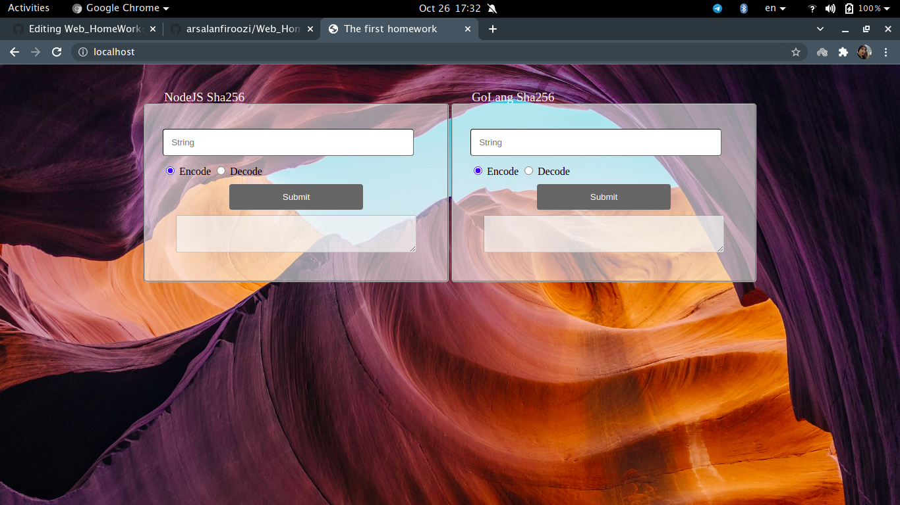

# **Frontend**

Index.html is used by Nginx container as the default page.

This page has a dynamic content by using Ajax Jquery script. Sending post and get requests to /go/sha256 and /node/sha256 is implemented.

The left box is used for NodeJS and the right one is used for GoLang to send data. 
Both NodeJS and GoLang uses method Get for encoding and Post for decoding.
Each box has two radio-button choosing the operation.

Input is checked by the front to check if the input has length < 8.

Sending form without any Input is checked through backend so that there will be no chance of damage.

Encoding includes responding the Hash and save it in database if not exist.

If user want to decode it's Hash, we search th database for this response and return it's ID found otherwise 'no record response'.

CSS is used to make page beauty.