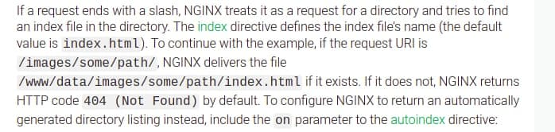

# **NodeJS**

Nginx is used to set up the front page and forward requests to Go and NodeJS servers.

By using 'volumes' option in docker-compose file, default.conf and nginx.conf is used inside container.

Nginx is port forwarded to port 80 by docker-compose.(The only port forwarded container)

These codes are used in 'default.conf' to forward requests.
>
    location /node/sha256 {
        proxy_pass   http://www.node.com:3000/node/;
    }

    location /go/sha256 {
        proxy_pass   http://www.go.com:9090/go;
    }

    location /node {
        proxy_pass   http://www.node.com:3000/node/;
    }

    location /go {
        proxy_pass   http://www.go.com:9090/go;
    }

    location /sha {
        proxy_pass   http://www.node.com:3000/node/;
    }
>

node/sha256 is forwarded to node server. 
go/sha256 is forwarded to go server. 
node is forwarded to node server. 
go is forwarded to node server. 
sha is forwarded to node server. 

# Challenges
By this documentation from Nginx site, never ever put '/' at the end of the address you're trying to forward.

Not observing this rule leads to <i><b>having appropriate response to Get requests but a 301 Error on Post requests.</b></i>

Never ever put '/' at the end of 'proxy_pass' for Golang server. Otherwise you would have 404 not found error.