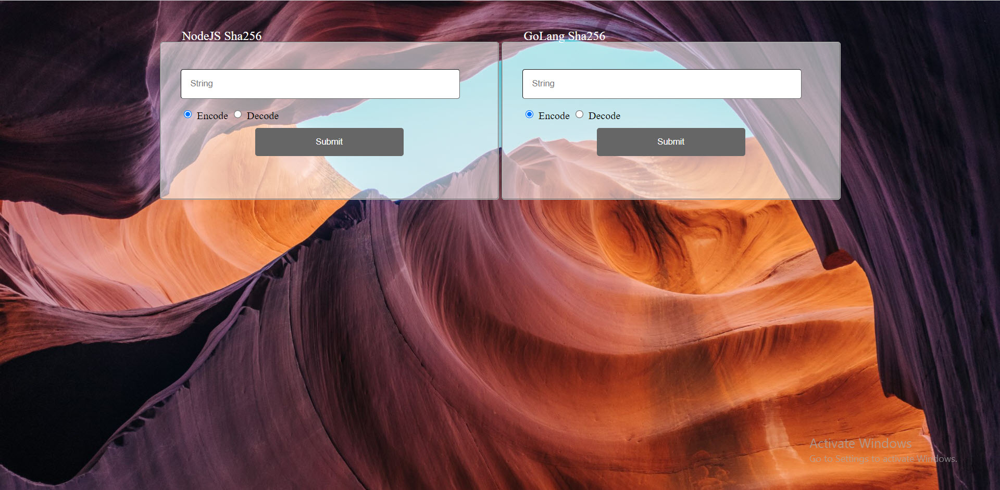

# **HW1 Web Programming**

- Arsalan Firoozi 
- Erfan Nosrati
- Amirhosein Javadi

## **Frontend**
The left box uses NodeJS and the right one uses GoLang to send data. Both NodeJS and GoLang uses method Get for ecoding and Post for decoding. Each box has two radio-button for encoding and decoding.

If user want to get Hash of it's ID, we check lenght of ID and if lenght is smaller than eight, we responde: 'Theres is not enough characters', otherwise we respond it's Hash and save this (ID,Hash) in database.

If user want to decode it's Hash, we search our database for this response and return it's ID if there is one. 

## **Golang**
In this part, we use gin to send messages. We add the headers to enable CORS
> c.Header("Access-Control-Allow-Origin", "*")
> 
> c.Header("Access-Control-Allow-Methods", "*")
> 
> c.Header("Access-Control-Allow-Headers", "*")
> 
> c.Header("Content-Type", "application/json")

First we first check lenght of our query and make appropriate response if it's too short, otherwise we create a query to database. 

We first send authentication message to database. This message contain include user, dbname and password of database to access it. 
> connStr := "user=admin dbname=test-db password=admin sslmode=disable"
> 
> sql.Open("postgres", connStr)

If user asked for ID of it's Hash (method=get), we seach database with this command:
> db.QueryRow("SELECT \"Key\" FROM public.\"Train\" where \"Hash\" = '" + Input + "'").Scan(&Key)

If we had error, it means that we don't have any data with the given Hash and we will responde "No record found", otherwise we will respond the user's key.

If user wants to Insert its ID and Hash (method=post), we first make the Hash of user's ID with sha256 method. Then we send this query to database to save this (ID,Hash).
> db.QueryRow("INSERT INTO \"Train\"(\"Key\",\"Hash\") VALUES ('" + Key + "','" + hash + "')")

## **NodeJS**
We create an application with express library and create hash with crypto library.
> const express = require('express')
> 
> const app = express()
> 
> app.use(express.json());
> 
> app.use(express.urlencoded({ extended: true }));
> 
> const crypto = require('crypto');

Then we read static data from config file and setting the port from config file
> const config_data = require('./config/config.json');
> 
> const { config } = require('process');
> 
> const port = config_data.port

Otherthings are implemented like Golang that was described before.

## **Postgres**
First of all we use this command to create a postgres in docker: 
> docker run --name docker-postgres -e POSTGRES_USER=admin  -e POSTGRES_PASSWORD=admin -d -p 5432:5432 postgres 

This will create a database and the user is admin and password is admin too.

For creating a new table with name "Train" with two column "Key" and "Hash" we use this script or create the table using pg admin:

> CREATE TABLE IF NOT EXISTS "Train" (
> 
>    "Key" varchar(250) NOT NULL,
>    
>    "Hash" varchar(250) NOT NULL);

## **Nginx**

We use Nginx as a reverse proxy. That means it redirect 

## **Load Results**
### **Golang Method**
