# **HW1 Web Programming**

- Amirhosein Javadi
- Arsalan Firoozi 
- Erfan Nosrati
# Dockerize the project

In this branch we've automated all the processes to build the project.(Dockerizing Golang, NodeJS, Postgress, Nginx services)
  
Implementation is based on dockerfiles in each directory in order to build the image and a docker-compose file in the branch folder to run containers in a network; So that containers can communicate. 

# Run the project 

By these commands you can run the project after cloning. 
> sudo service apace2 stop

> docker ps -q | xargs docker rm -f

> docker-compose up -d -- build

This command can stop the project.
> docker-compose down 

Database is based on postgres and is automaticly created(Db, Tables) on the first request to Go server or NodeJS server.

# Report

[Frontend](/Front/ReadMe.md) : Code is described in the folder.

[NodeJS](/NodeJS/ReadMe.md) : Code is described in the folder.

[Golang](/Go/ReadMe.md) : Code is described in the folder.

[Nginx](/Nginx/ReadMe.md) : Code is described in the folder.

Locust :
3 different rate of requests are used for testing the Go server and NodeJS server.

* Node:
    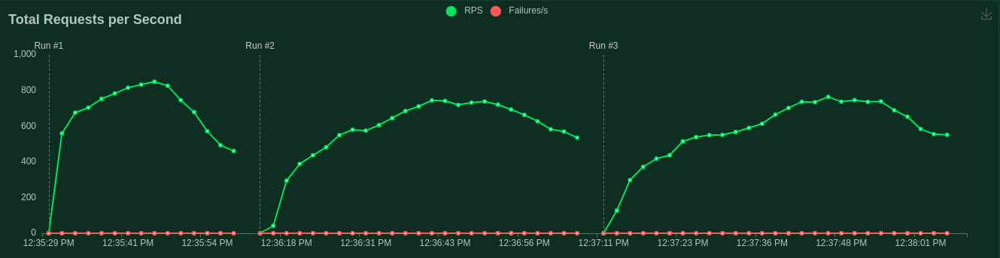
    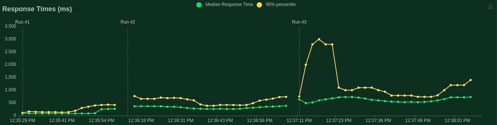
    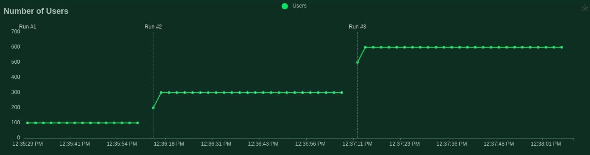
    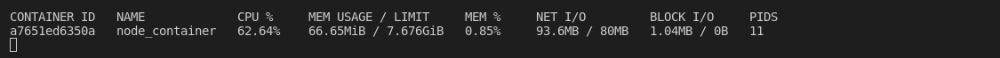
    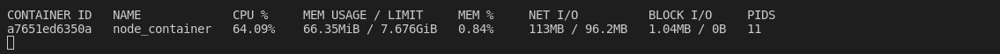
    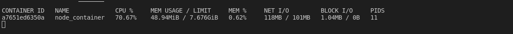

* Go:
    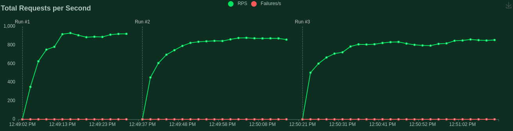
    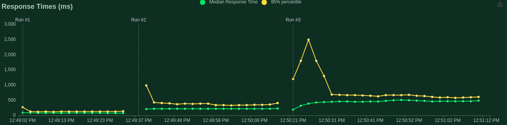
    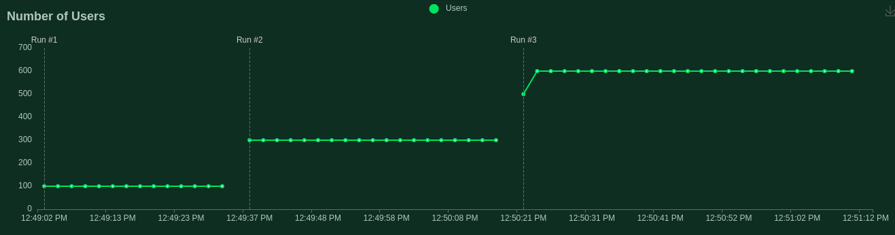
    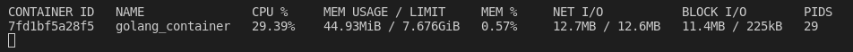
    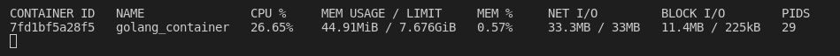
    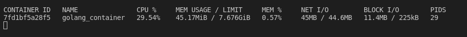