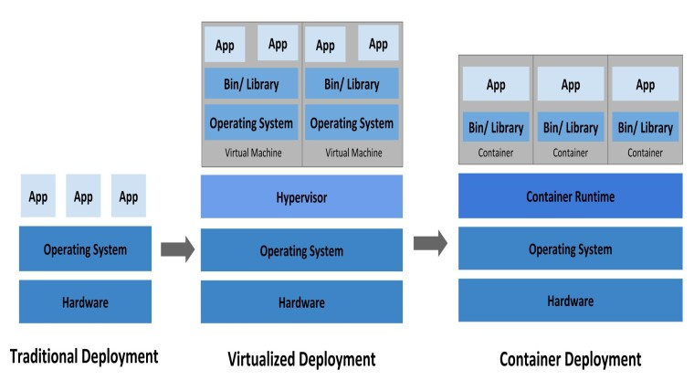
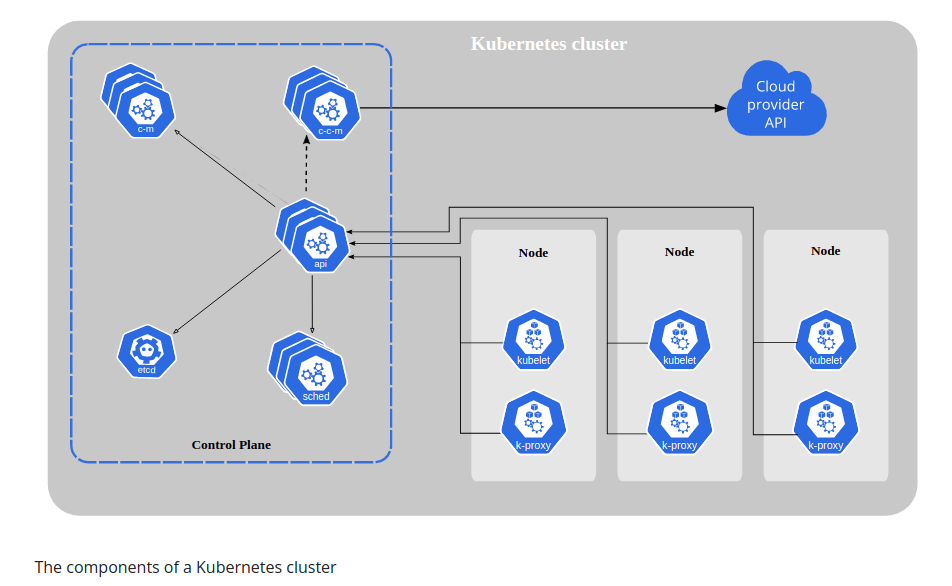
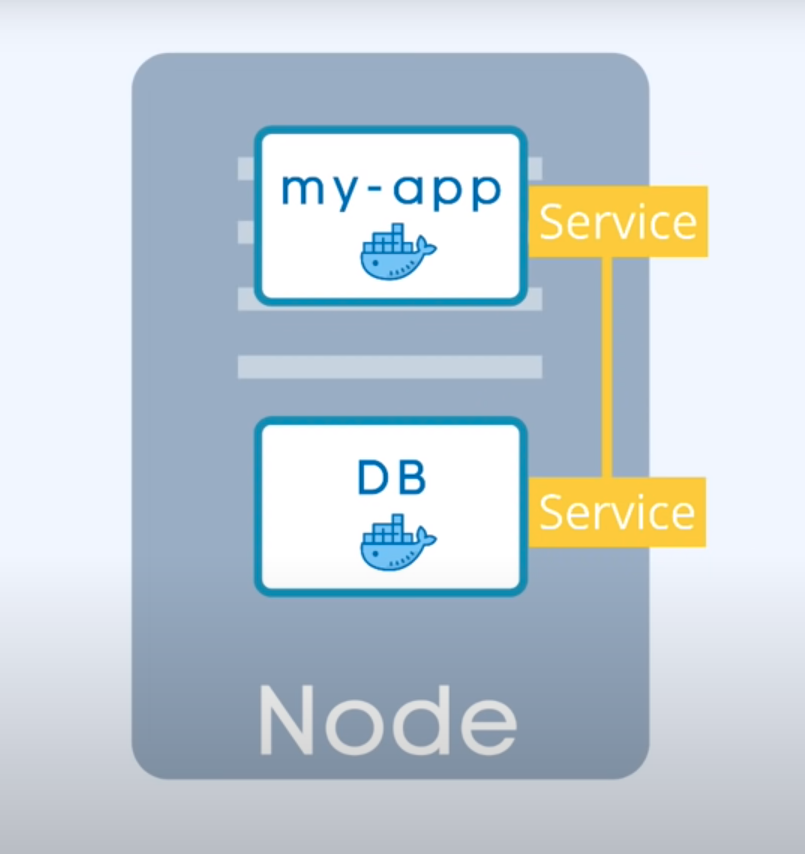

Kubernetes
==========

<div style="direction:rtl;text-align:justify;">
تحقیق میانترم سال ۱۴۰۰

اعضای گروه:
</div>

* Erfan Nosrati, 97102558
* Arsalan Firoozi, 97102225
* Amirhossein Javadi, 97101489

<hr>

<div style="direction:rtl;text-align:justify;">
<h2>قسمت اول: آشنایی با <b>Kubernetes</b></h2>

<div style="text-align:center">

</div>

کوبرنتیز یا K8s (که عدد ۸ بیانگر تعداد حروف بین K و s است) یک پلتفرم متن باز است که توسط گوگل توسعه یافته است و اجرا و مدیریت اتوماتیک کانتینر هارا بر عهده می‌گیرید و به شما در مدیریت اجرای برنامه کانتینری در محیط‌های مختلف مانند سرورها؛ سرویس های ابری و ... کمک می‌کند. برای ادامه بحث و فهمیدن هرچه بهتر کوبرنتیز باید ابتدا با مفهوم کانتینر آشنا شویم. (می‌توانید در صورتی که با این مفهوم آشنایی دارید از این قسمت عبور کنید.)
<br>
<br>
<br>
<h3>استقرار برنامه</h3>
استقرار برنامه در طول زمان دچار دگرونی هایی شده است. استقرار برنامه به طور سنتی به این شکل بود که برنامه روی سخت افزار یک سیستم عامل نصب می‌شود و چندین برنامه روی این سیستم عامل اجرا می‌شوند. همانطور که قابل حدس است این شیوه از استقرار نرم افزار ممکن است باعث تداخل در منابع تخصیص یافته شود. برای مثال در نظر بگیرید که یک برنامه بیشتر منابع را در اختیار بگیرد و باعث شود برنامه‌های دیگر عملکرد مناسب خود را نداشته باشند.
<br>
<br>
مشکل دیگر این روش کار نکردن درست برنامه در ماشین‌های متفاوت است. فرض کنید یک برنامه نویس یک برنامه را توسعه داده و در ماشین خودش تمام تست‌ها را پاس کرده اما وقتی این برنامه را به تیم عملیات می‌دهد این برنامه به درستی کار نمی‌کند و این درست کار نکردن به علت خیلی مشکلات از قبیل تفاوت در لایبری‌ها و ورژن های آنها و ... می‌تواند باشد. ( برای خواندن میم های جذاب در این باره عبارت but it works on my machine meme را جستجو کنید :) )
<br>
<div style="text-align:center"></div>

شیوه دیگر استقرار برنامه مجازی‌سازی است (Virtualized) در این روش بر روی یک سیستم عامل ماشین‌‌های مجازی ساخته می‌شوند که این ماشین های مجازی سیستم عامل خود را دارند و این باعث ایزوله شدن برنامه‌های ماشین‌های مجازی مختلف می‌شود و باعث بهبود مقیاس پذیری و توانایی نگه‌داری از برنامه می‌شود.
<br>
<br>
شیوه نوین استقرار برنامه شیوه استقرار توسط کانتینر ها است. ایده کانتینر از شرکت های کشتی رانی گرفته شده است چون در شرکت‌های کشتی رانی محموله حمل شده مهم نیست آنها صرفا تعدادی جعبه فلزی به اسم کانتینر را جا‌به‌جا‌ و نگه داری می‌کنند و با محتوای داخلی آن ها کاری ندارند.
<br>
<br>
کانتینرها‌ مانند سبک‌تر از ماشین‌های مجازی هستند و با این تفاوت که می‌توانند به طور مستقل از هم بر روی یک سیستم عامل اجرا شوند و این ویژگی باعث می‌شود که ایجاد و استقرار برنامه به روش کانتینر مزیت‌های بسیاری مانند سریع بودن؛ ایجاد روش امن برای عقب‌گرد: عملکرد تقریبا یکسان در همه پلتفرم ها و ... را داراست.در ادامه متن هر کجا از داکر که یکی از محبوب ترین روش کانتینر کردن اپلیکیشن هاست استفاده کردیم منظور روش استقرار به وسیله کانتینرها است.<br>
<div style="text-align:center"></div>
<br>
<br>
<h3>کوبرنتیز چه کاری انجام می‌دهد؟</h3>
قبل از اینکه در مورد کوبرنتیز صحبت کنیم ابتدا ببینیم که یک ابزار ارکستریشن (مانند کوبرنتیز) چیست؟
<br>
<br>
به وجود آمدن مفهوم ماکروسرویس ها باعث پرطرفدار شدن کانتینرها شد زیرا بسترهای سبکی هستند که می‌توانند این برنامه های سبک و مستقل را در خود اجرا کنند. و مدیریت این کانتینرها که در محیط‌های مختلف با استفاده از اسکریپت‌ها و برنامه‌های تحت نظر انسان قابل انجام نیست یا بسیار سخت است. برای مثال زمانی که در مرحله production هستیم اطمینان از بالا بودن برنامه برای ما بسیار مهم است و در این نقطه است که کوبرنتیز به کمک ما آمده و مدیریت کانتینرها را بر عهده می‌گیرید.
<br>
<br>
کوبرنتیز سرویس های زیر را ارائه می‌ده:

1. دردسترس بودن و نگه داری از سرویس ها: یکی از تضمین هایی که کوبرنتیز به ما می‌دهد نبود زمانی است که سرویس ها پایین باشند. برای مثال اگر یک کانتینر دچار مشکل شود کوبرنتیز سعی می‌کند آن را بازیابی کند و یا یک کانتینر دیگر با آن جایگزین کند.
1. مقیاس پذیری: کوبرنتیز اجازه افزایش ظرفیت برنامه شما را به صورت سریع می‌دهد.
1. پخش بار: کوبرنتیز می‌توانند درخواست ها را بین کانتینر های مختلف تقسیم کند به طوری که سیستم پایدار باشد.
1.  منتشر کردن و عقب‌گرد اتوماتیک: فرض کنید که می‌خواهید ورژن جدید برنامه خود را منتشر کنید و می‌‌خواهید کارایی آن را تست کنید. برای اینکار ۱۰ درصد از کاربران خود را انتخاب کرده و درخواست این افراد را به ورژن جدید انتقال می‌دهید و تست های خود را انجام می‌دهید اگر موفقیت آمیز بود ورژن جدید را منتشر کرده و همه کاربران را به ورژن جدید می‌برید و در صورت خرابی به ورژن قبلی عقب گرد می‌کنید. این کار که در اینجا توصیف شد را می‌توان به صورت خودکار توسط کوبرنتیز انجام داد.
1. تخصیص بهنیه سخت افزار: کوبرنتیز این قابلیت را به شما می‌دهد تا منابع مورد نیاز برای هر کانتینر را مشخص کنید سپس خود کوبرنتیز با توجه به میزان سخت افزار شما کانتینرها را به صورتی انتخاب می‌کند که بهترین استفاده را از سخت افزار شما داشته باشد.
1. بازیابی: یکی دیگر از امکاناتی که کوبرنتیز در اختیار شما قرار می‌دهد امکان بازیابی اطلاعات و حالت برنامه هنگام وقوع یک خطا است.
<br>
<br>
<h3>چه کاری را انجام نمی‌دهد؟</h3>
اما باید در نظر داشته باشیم که کوبرنتیز یک محیط با سخت افزار نیست و روی سخت افزار شما بالا می‌آید و کارهایی مانند ‌‌Build و تست سورس کد های یا فرآیند های CI/CD را انجام نمی‌دهد. همچنین کوبرنتیز خدمات لایه اپلیکیشن را ارائه نمی‌دهد و تنها image ها و کانتینر های شما را مدیریت می‌کند.
<br>
<br>
<h3>نتیجه گیری</h3>
کوبرنتیز مدیریت و اتوماسیون استقرار یک سیستم مبتنی بر کانتینر را بر عهده دارد. در قسمت بعد درباره چگونگی انجام این کار توسط کوبرنتیز و قسمت های مختلف آن توضیح می‌دهیم.

<hr>
<h2>قسمت دوم: کوبرنتیز چگونه کار می‌کند؟</h2>
در قسمت قبل با کوبرنتیز آشنا شدیم و فهمیدیم کوبرنتیز چه کارهایی را برای ما انجام می‌دهد. در این قسمت ابتدا با معماری کوبرنتیز و سپس با اجزای مختلف آن آشنا می‌شویم.
<br>
<br>
<h3>معماری کوبرنتیز</h3>
کوبرنتیز از حداقل یک کنترل کننده (Control Plane) و یک ماشین کارگر (که به آن Node یا Worker Node گفته می‌شود) تشکیل شده است. کنترل کننده که بیشتر فرآیندهای (Processes) کوبرنتیز در آن اجرا می‌شوند؛ نقش
مدیریت، نظارت و هماهنگی کار بین گره‌های کارگر(Worker Node) را دارد که برنامه ها را اجرا می‌کنند و بیشتر منابع سخت افزاری را در اختیار دارند زیرا اجرای برنامه اصلی بر عهده همین نود‌های کارگر است و کنترل کننده تنها بر درستی و سالم بودن و دیگر موارد هماهنگ کننده بین این نود‌ها از قبیل تست‌ها و ... نظارت می‌کند.
<br>
<div style="text-align:center"></div>
<br>
<br>
<h3>اجزای تشکیل دهنده Node</h3>
نودها سرور ها یا ماشین های مجازی هستند و از اجزای زیر تشکیل شده اند:<br>



* پاد (‌Pod):<br>
پاد کوچکترین قسمت نودهای کارگر هستند که یک لایه Abstraction به کانتینر ها اضافه می‌کند و در اصل بستر اجرای ایمیج‌ها و کانتینرها است و معمولا در هر پاد تنها یک کانتینر اجرا می‌شود. و اضافه شدن این لایه باعث‌ می‌شود پیچیدگی های سطح کانتینر در کوبرنتیز وارد نشود. هر پاد زمانی که اجرا می‌شود یک IP جدید می‌گیرید و این در جایی مشکل ساز می‌شود که یک از پادهای دچار خطا می‌شود و یک پاد دیگر را جایگزین آن می‌کنیم. در این صورت باید در اجزای دیگر که با این پاد در ارتباط هستند IP جدید را بروزرسانی کنیم.
* سرویس (Service): <br>
برای حل کردن مشکل ‌عوض شدن IP پادها سرویس ها استفاده می‌شوند. سرویس ها IP های ثابتی هستند که به یک پاد متصل می‌شوند و با از بین رفتن یک پاد سرویس از بین نمی‌رود و پاد جایگزین شده به این سرویس متصل شده و در این صورت پاد‌های ما همواره IP های ثابتی دارند که با از بین رفتن و جایگزین شدن پادها تغییر نمی‌کنند.
* کیوبلت (Kubelet):<br>
کیوبلت‌ها ایجنت‌هایی هستند که اطمینان حاصل می‌کنند تا کانتینر ها درون پادها به درستی اجرا می‌شوند و همچنین ارتباط بین Node های مختلف را ممکن می‌سازند.
* کانفیگ مپ (ConfigMaps):<br>
برای توضیح این کامپوننت از یک مثال استفاده می‌کنیم. فرض کنید یک برنامه دارید که دیتا های خود را درون یک دیتابیس ذخیره می‌کند. پس باید آدرس این دیتابیس را درجایی ذخیره کنیم. اگر این آدرس را داخل ایمیج ساخته شده قرار دهیم و در زمانی دیگر آدرس دیتابیس تغییر کند ما مجبور می‌شویم ایمیج ساخته شده را دوباره بیلد کنیم و در داخل ریپازیتوری قرار دهیم و سپس این ایمیج را از ریپازیتوری برداریم. برای رفع این مشکل یک کامپوننت با نام ‌ConfigMap در کوبرنتیز وجود دارد که به ما این امکان را می‌دهد تا دیتاهای تغییرپذیر و خارجی مانند آدرس دیتا بیس را در آن ذخیره کنیم و در صورت تغییر این داده ها تنها این داده ها را تغییر داده و نیازی به فرآیندهای بیلد و پوش کردن ایمیج نباشد.
* Secret:<br>
حال در همان مثال بالا حالتی را در نظر بگیرید که می‌خواهید نام‌کاربر و رمز دیتابیس که آن ها نیز تغییر پذیرند را در جایی ذخیره کنید از آن جایی که ConfigMap تنها برای دیتاهای غیرمحرمانه است کامپوننت دیگری به نام secret وجود دارد که می‌توان داده‌های با حساسیت بالاتر را در آن ها ذخیره کرد.
<br>
<br>
<h3>اجزای تشکیل دهنده کنترل کننده (Control Plane)</h3>

* kube-apiserver:<br>
این ماژول؛ در حقیقت ماژول ارتباطی ما با کوبرنتیز است که ما می‌توانیم با API یا UI یا CLT بسته به نوع استفاده (برای مثال داشبورد یا استفاده از اسکریپت‌های اتوماتیک) از آن استفاده کنیم. ‌
* kube-scheduler:<br>
این کامپوننت پاد‌های جدید را که داری نود نیستند در نود ها قرار می‌دهد. برای مثال فرض کنید دو نود داریم که یکی از 60 درصد منابعش استفاده کرده است و دیگری از 20 درصد منابع در این صورت این کامپوننت پاد جدید به وجود آمده را در داخل نودی که منابع بیشتری دارد قرار می‌دهد.
* etcd:<br>
این کامپوننت دیتاهای کلاستر های ما را نگه داری می‌کند. و کلاستر ها از این دیتا ها برای برای بازسازی در زمانی که خطا رخ می‌دهند استفاده می‌کنند.
* kube-controller-manager:<br>
این کامپوننت تغییرات داخل کلاستر را دنبال می‌کند و مدیریت می‌کند.مثلا اگر کانتینری نیاز به تعمیر داشته باشد یا خراب شده باشد آن را درست یا جایگزین می‌کند.
<br>
<br>
<h3>نتیجه‌گیری</h3>
در این قسمت درباره قسمت‌های اصلی کوبرنتیز صحبت کردیم و اجزای اصلی کنترل‌کننده و Node های آن را به صورت مختصر مورد بررسی قرار دادیم.

<hr>
<h2>قسمت سوم: پیاده‌سازی k3s
در این قسمت ابتدا کوبرنتیز را روی یک ماشین با سیستم عامل ubuntu 20.04 نصب می‌کنیم سپس یک ایمیج فرانت‌اند را توسط کوبرنتیز اجرا می‌کنیم. به دلیل تحریم ما قادر نیستیم که خود کوبرنتیز را دانلود کنیم به همین علت از یک نمونه مشابه آن به نام k3s استفاده می‌کنیم که یک توزیع از کوبرنتیز اما سبک‌تر از آن و پیچیدگی های‌ نصب کامپوننت‌های مختلف کوبرنتیز در این توزیع وجود ندارد و ما می‌توانیم توجه خود را معطوف استفاده از این برنامه‌ کنیم لینک سایت و گیت‌هاب این پروژه. نکته جالب درباره اسم این پروژه این است که خود کوبرنتیز با علامت اختصاری k8s شناخته می‌شود که ۸ مخفف ۸ حرف وسط آن است و از آنجایی که این توزیع نصف کوبرنتیز حجم دارد از k3s استفاده کرده است. در ادامه به پیاده سازی یک سرویس k3s شامل یک node کارگر و یک master می‌پردازیم.


ما در این قسمت سعی داریم معماری بالا را پیاده سازی کنیم. همانطور که در تصویر بالا قابل مشاهده است این معماری شامل یک Master Node و تعداد Worker Node است که در قسمت قبل درباره آن صحبت کرده‌ایم. ما در پیاده سازی قسمت بعد تنها از یک Worker Node استفاده می‌کنیم. قسمت load balancer را نیز پیاده سازی نمی‌کنیم زیرا تنها یک نود داریم و خارج از حوصله این نوشته است.

<h2>پیش از شروع</h2>
پیش از شروع نصب k3s ما باید دو ماشین داشته باشیم تا بتوانیم در یکی از آنها Master Node و در دیگری Worker Node را پیاده‌سازی کنیم. برای اینکار من از<a href="https://www.virtualbox.org/wiki/Linux_Downloads">Virtual Box</a>استفاده کرده‌ام در پایین آموزش مختصر آن را
را می‌آوردم.

پس از نصب<a href="https://www.virtualbox.org/wiki/Downloads"> دانلود </a> این برنامه با استفاده از این لینک می‌توانید یک <a href="https://docs.oracle.com/cd/E26217_01/E26796/html/qs-create-vm.html">ماشین</a> مجازی ایجاد کنید. همانطور که در قسمت قبل توضیح داده شد ما به دو ماشین مجازی نیاز داریم. سیستم عامل هر یک از این ماشین ها در این مثال ubuntu live server 20.04 LTS است که اگر با ترمینال آشنایی ندارید یا کار با آن برای شما سخت است می‌توانید ابونتوی عادی را نیز نصب کنید.

پس از نصب و راه‌اندازی سرور ها برای اینکه بتوانید از ماشین خود به آنها دسترسی ssh داشته باشید در setting و در قسمت Network نتورک را از حالت Nat به حالت bridge در آورید سپس می‌توانید از سیستم عامل خود به این ماشین ها ssh بزنید.


<h3>راه‌اندازی Master</h3>
ابتدا برای نصب آن دستور زیر را میزنیم:
</div>

```install
curl -sfL https://get.k3s.io | sh -s - --no-deploy traefik --write-kubeconfig-mode 644 --node-name master
```

<div style="direction:rtl;text-align:justify;">
متغییر اول این باعث می‌شود load balancer غیر فعال شود و متغیر دوم تغییرات متغیرها را انجام می‌دهد و متغیر سوم نام نود است. پس از زدن دستور بالا این دستور می‌تواند چندین دقیقه طول بکشد و زمانی که تمام شد برای اطمینان از درستی آن دستور زیر را بزنید:
</div>

```
kubectl get nodes
```

<div style="direction:rtl;text-align:justify;">
باید نتیجه‌ای مانند زیر را دریافت کنید:
</div>

```
NAME         STATUS      ROLES                            AGE       VERSION
master        Ready         control-plane,master   10m       v1.22.5+k3s1
```

<div style="direction:rtl;text-align:justify;">
این موضوع نشان دهنده آن است که نود مستر به درستی در حال اجرا شدن است و کار ما در این قسمت تمام است.

<h3>راه‌اندازی Worker</h3>
در این قسمت باید مطمئن شویم که دو ماشین مجازی به یکدیگر ping دارند زیر در نصب worker باید مشخص کنیم که این نود مختص کدام نود ‌‌Master است. برای این کار باندا در ماشین ‌Master باید یک توکن را کپی کنیم تا در نود Worker آن را وارد کنیم. برای این کار دستور زیر را بزنید و خروجی حاصل را کپی کنید.
</div>

```
sudo cat /var/lib/rancher/k3s/server/node-token
K10c0170e30504120ffe8cb696d6391c6623b6667954e3ad51be09f540e1bfadf9d::server:aa33e4e0133f721bd1f812528dd4af5b
```

<div style="direction:rtl;text-align:justify;">
حال به ماشین Worker بروید و دستور زیر را اجرا کنید. و به جای IP باید IP نود مستر را قرار دهید و به جای TOKEN نیز توکن قسمت قبل را کپی کنید.
</div>

```
curl -sfL https://get.k3s.io | K3S_NODE_NAME=k3s-worker-01 K3S_URL=https://<IP>:6443 K3S_TOKEN=<TOKEN> sh -
```

<div style="direction:rtl;text-align:justify;">
برای مثال آدرس ‌IP ماشین مستر من 192.168.4.7 بود و دستور برای من به شکل زیر شد:
</div>

```
url -sfL https://get.k3s.io | K3S_NODE_NAME=worker K3S_URL=https://192.168.4.7:6443 K3S_TOKEN=K10c0170e30504120ffe8cb696d6391c6623b6667954e3ad51be09f540e1bfadf9d::server:aa33e4e0133f721bd1f812528dd4af5b sh -
```

<div style="direction:rtl;text-align:justify;">
پس از راه اندازی این قسمت که باز ممکن است چندین دقیقه به طول بی‌انجامد درستی آن را چک می‌کنیم برای این کار باید به ماشین Master برویم و دستور زیر را که در قسمت قبل زده بودیم دوباره تکرار کنیم:
</div>

```
kubectl get nodes
NAME STATUS ROLES AGE VERSION
master Ready control-plane,master 31m v1.22.5+k3s1
worker Ready <none> 78s v1.22.5+k3s1
```

<div style="direction:rtl;text-align:justify;">
همانطور که مشاهده می‌شود به لیست ما در ماشین Master نود Worker اضافه شده است. حال ما یک k3s با یک نود Master و یک نود Worker پیاده سازی کرده ایم و تنها یک Ingress برای دیدن برنامه از بیرون و یک image برای اجرا شدن روی این نود ها نیاز داریم.

<h3> پیاده‌سازی یک کانتینز ساده بر روی k3s </h3>

پس از مراحل بالا ما حال به یک فایل yaml نیاز داریم که به نود مستر اطلاعات مورد نیاز برای دیپلوی کردن image داده شده را بدهد برای اینکار یک فایل با محتویات زیر نیازمندیم.
</div>

```
apiVersion: apps/v1
kind: Deployment
metadata:
name: sharif-web-course
spec:
replicas: 4
selector:
matchLabels:
app: sharif-web-course
template:
metadata:
labels:
app: sharif-web-course
spec:
containers:
- image: frontend
imagePullPolicy: "Always"
name: sharif-web-course
ports:
- containerPort: 8080

-------------------------------------

apiVersion: v1
kind: Service
metadata:
labels:
app: sharif-web-course
name: sharif-web-course
spec:
ports:
- name: http
port: 80
targetPort: 8080
selector:
app: sharif-web-course

---------------------------------

apiVersion: networking.k8s.io/v1
kind: Ingress
metadata:
name: sharif-web-course
spec:
rules:
- http:
paths:
- path: /
pathType: ImplementationSpecific
backend:
service:
name: sharif-web-course
port:
number: 80
```

<div style="direction:rtl;text-align:justify;">
که دو قسمتی که با خط تیره جدا شده اند نقش Ingress را بازی می‌کنند و در اینجاا از<a href="https://kubernetes.github.io/ingress-nginx/"> ingress-nginx</a> استفاده شده است. این دیپلوی منت از <a href="https://gitlab.com/cloud-versity/rancher-k3s-first-steps/-/blob/main/manifest.yaml"> این جا </a> برداشته شده است و متانسب با image ما تغییر یافته است ضمنا قسمت آخر این مانیفست حذف شده است زیرا کاربرد DNS را دارد که برای ما مورد نیاز نیست.

در جلوی تگ image به جای front باید آدرس ایمیج از یک رجیستری داده شود. اما این قسمت را به دلیل فیلتر بودن از سمت داکر رجیستری نتوانستیم راه حلی برای آن پیاده سازی کنیم.

<br>
امیدوارم لذت برده باشید.